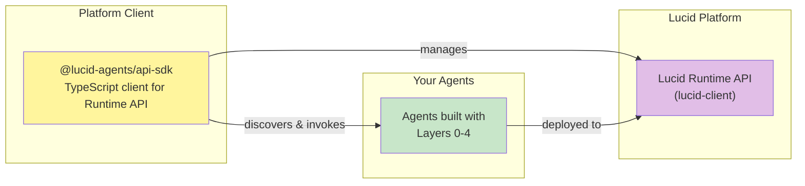
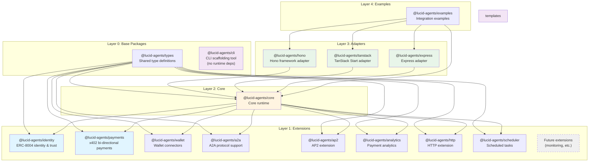
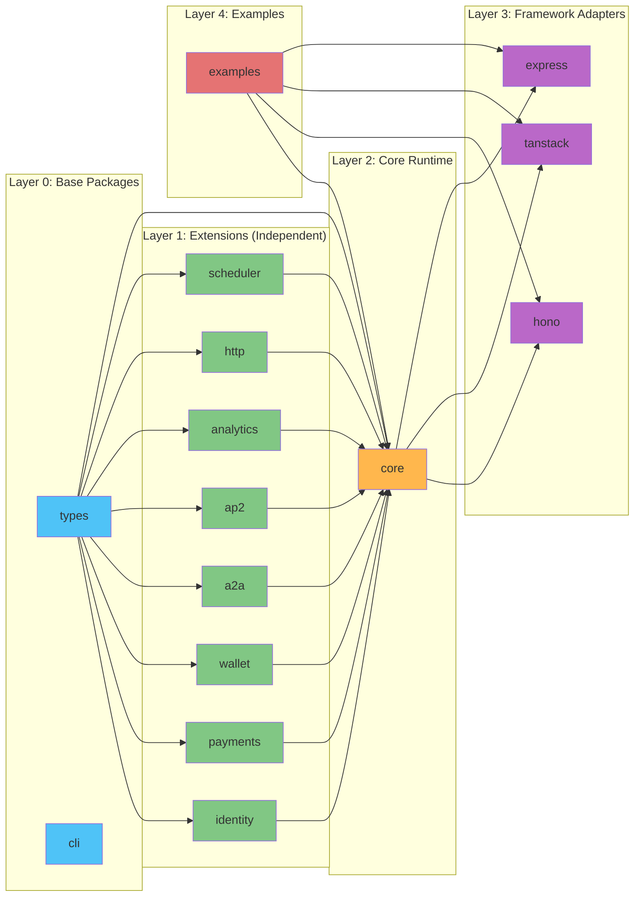
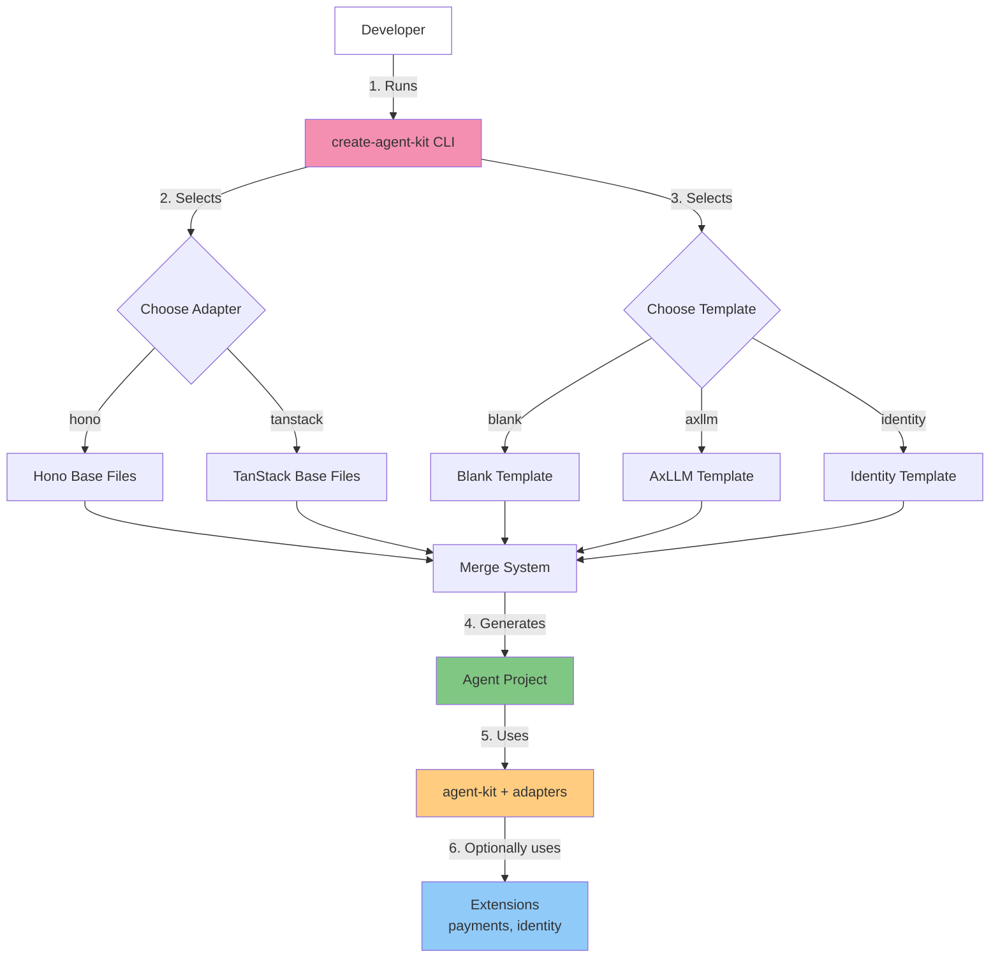
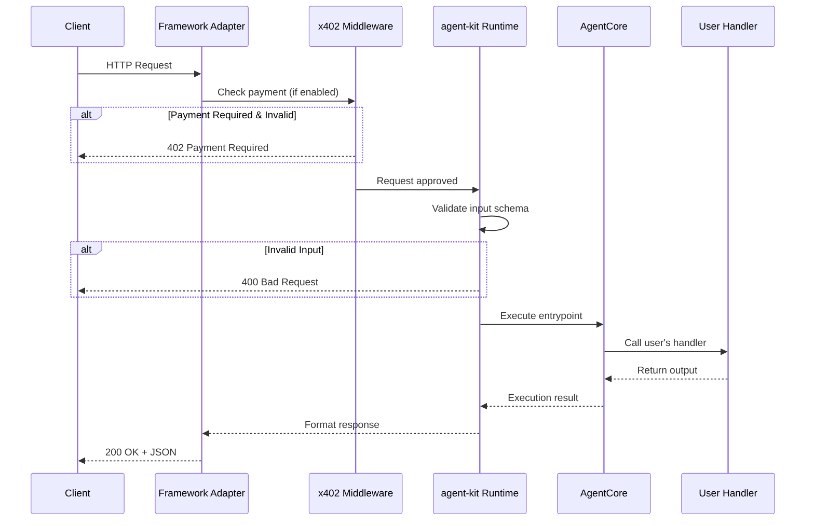
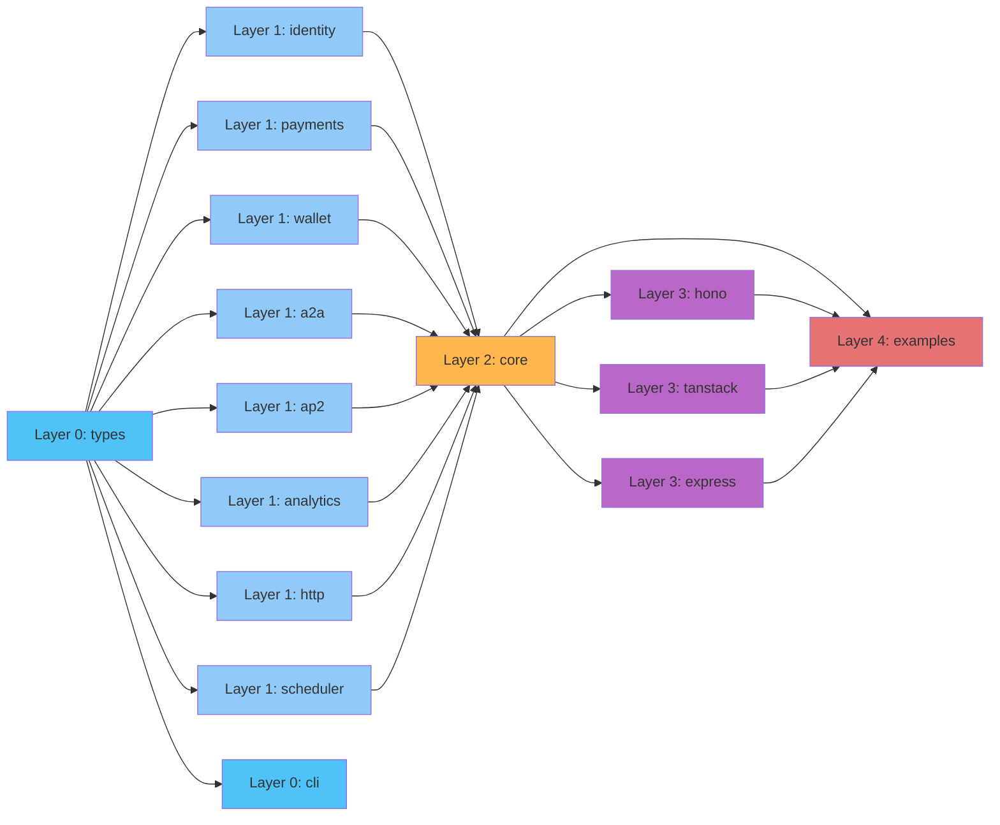

# Lucid Agents - SDK Architecture

High-level architecture overview of the Lucid Agents SDK.

## Package Structure

The SDK is organized into five architectural layers, plus a companion client package:

## Platform Client

Before diving into the agent-building layers, there's a companion package for interacting with the hosted platform:



**@lucid-agents/api-sdk** enables:
- **Agent Factories**: Build agents that create and manage other agents
- **Platform Dashboards**: Build UIs for agent management and analytics
- **Agent-to-Agent**: Discover and invoke other agents with x402 payments

See [API-SDK Documentation](./API-SDK.md) for full details.

---

## Package Structure

The SDK is organized into five architectural layers:



## Dependency Graph



Note: Dependencies are one-directional. @lucid-agents/core imports from extensions (both types and runtime functions). All packages import shared types from @lucid-agents/types. This pure DAG structure eliminates circular dependencies.

## Layer 1: Extensions

Extensions add optional capabilities. They are independent and don't depend on each other.

### @lucid-agents/identity

**Purpose:** ERC-8004 on-chain identity and trust layer

**Provides:**

- Registry clients (Identity, Reputation, Validation)
- Trust configuration
- Domain proof signing
- `createAgentIdentity()` bootstrap function

**Dependencies:** `viem` (Ethereum interactions)

---

### @lucid-agents/payments

**Purpose:** x402 payment protocol (bi-directional)

**Provides:**

- Entrypoint definitions (priced capabilities)
- Payment requirement resolution (server-side)
- x402 client utilities (client-side)
- Payment configuration and validation
- Multi-network support (EVM and Solana)

**Dependencies:** `x402`, `x402-fetch`, `zod`

---

### @lucid-agents/wallet

**Purpose:** Wallet connectors and helpers for agent operations

**Provides:**

- Wallet client creation and management
- Multi-network wallet support (EVM and Solana)
- Wallet configuration utilities

**Dependencies:** `viem` (Ethereum interactions)

---

### @lucid-agents/a2a

**Purpose:** Agent-to-Agent (A2A) protocol implementation

**Provides:**

- Agent Card building and fetching
- A2A client utilities (invoke, stream, task operations)
- Task-based operations (sendMessage, getTask, listTasks, cancelTask)
- Multi-turn conversation support with contextId
- A2A runtime integration

**Dependencies:** `@lucid-agents/types`, `zod`

---

### @lucid-agents/ap2

**Purpose:** AP2 (Agent Payments Protocol) extension

**Provides:**

- AP2 runtime creation
- Agent Card enhancement with AP2 extension metadata
- AP2 role management (merchant, shopper)

**Dependencies:** `@lucid-agents/types`

---

### @lucid-agents/analytics

**Purpose:** Payment analytics and reporting

**Provides:**

- Payment summary statistics (outgoing, incoming, net)
- Transaction history and filtering
- CSV/JSON export for accounting systems
- Time-windowed analytics

**Dependencies:** `@lucid-agents/types`, `viem`

---

### @lucid-agents/http

**Purpose:** HTTP extension for request/response handling

**Provides:**

- HTTP request/response handling
- Server-Sent Events (SSE) streaming
- HTTP invocation utilities

**Dependencies:** `@lucid-agents/types`

---

### @lucid-agents/scheduler

**Purpose:** Scheduled task execution

**Provides:**

- Task scheduling and execution
- Interval-based tasks
- Cron-like scheduling

**Dependencies:** `@lucid-agents/types`

## Layer 2: Core

### @lucid-agents/core

**Purpose:** Framework-agnostic agent runtime

**Provides:**

- Agent execution (`AgentCore`)
- HTTP request handlers (invoke, stream, tasks)
- Server-Sent Events (SSE) streaming
- Manifest generation (AgentCard, A2A)
- Task management (create, get, list, cancel, subscribe)
- Configuration management
- Landing page UI

**Dependencies:** `@lucid-agents/payments`, `@lucid-agents/identity`, `@lucid-agents/wallet`, `@lucid-agents/a2a`, `@lucid-agents/ap2`, `@lucid-agents/analytics`, `@lucid-agents/http`, `@lucid-agents/scheduler`

## Layer 3: Adapters

Adapters integrate the core runtime with specific web frameworks.

### @lucid-agents/hono

**Purpose:** Hono framework integration

**Provides:**

- `createAgentApp()` - Returns Hono app instance
- `withPayments()` - x402-hono middleware wrapper
- Automatic route registration for tasks, entrypoints, manifest

**Dependencies:** `@lucid-agents/core`, `hono`, `x402-hono`

---

### @lucid-agents/tanstack

**Purpose:** TanStack Start framework integration

**Provides:**

- `createTanStackRuntime()` - Returns runtime & handlers
- `withPayments()` - x402-tanstack middleware wrapper
- Route files for tasks, entrypoints, manifest

**Dependencies:** `@lucid-agents/core`, `@tanstack/start`, `x402-tanstack-start`

---

### @lucid-agents/express

**Purpose:** Express framework integration

**Provides:**

- `createAgentApp()` - Returns Express app instance
- `withPayments()` - x402 Express middleware wrapper
- Automatic route registration for tasks, entrypoints, manifest

**Dependencies:** `@lucid-agents/core`, `express`, `x402-express`

## Layer 0: Base Packages

### @lucid-agents/types

**Purpose:** Shared type definitions (foundational package)

**Provides:**

- All shared TypeScript type definitions
- Zero dependencies on other @lucid-agents packages
- Single source of truth for type contracts

**Dependencies:** External only (zod, x402)

---

### @lucid-agents/cli

**Purpose:** CLI for scaffolding new agent projects

**Provides:**

- Interactive project wizard
- Template system (blank, axllm, identity, axllm-flow, trading-data-agent (merchant), trading-recommendation-agent (shopper))
- Adapter selection (hono, tanstack-ui, tanstack-headless, express)
- Merge system (combines adapter + template)

**Dependencies:** None (no runtime dependencies on other @lucid-agents packages; only generates code that references them)

## Developer Flow



## Request Flow

How an HTTP request flows through the system:



## Build Order

Packages must build in dependency order:



Note: Layer 0 packages (types, cli) have no internal dependencies. Layer 1 extensions are independent and can build in parallel. Core depends on all extensions, adapters depend on core, and examples depend on all packages.

## Package Responsibilities

| Package                   | Layer    | Responsibility                                               |
| ------------------------- | -------- | ------------------------------------------------------------ |
| `@lucid-agents/api-sdk`   | Client   | TypeScript client for Runtime API (agent management, invocation, analytics) |
| `@lucid-agents/types`     | 0        | Shared type definitions (zero dependencies)                  |
| `@lucid-agents/cli`       | 0        | CLI tool, templates, project scaffolding (no runtime deps)   |
| `@lucid-agents/identity`  | 1     | ERC-8004 on-chain identity, registries, trust models         |
| `@lucid-agents/payments`  | 1     | x402 protocol, EntrypointDef, pricing, payment client/server |
| `@lucid-agents/wallet`    | 1     | Wallet connectors and helpers for agent operations           |
| `@lucid-agents/a2a`       | 1     | A2A protocol implementation, Agent Cards, task operations    |
| `@lucid-agents/ap2`       | 1     | AP2 extension for Agent Cards                                |
| `@lucid-agents/analytics` | 1     | Payment analytics and reporting                              |
| `@lucid-agents/http`      | 1     | HTTP extension for request/response handling                 |
| `@lucid-agents/scheduler` | 1     | Scheduled task execution                                     |
| `@lucid-agents/core`      | 2     | Core runtime, HTTP handlers, SSE, manifest, config, UI       |
| `@lucid-agents/hono`      | 3     | Hono framework integration, middleware wiring                |
| `@lucid-agents/tanstack`  | 3     | TanStack framework integration, middleware wiring            |
| `@lucid-agents/express`   | 3     | Express framework integration, middleware wiring             |
| `@lucid-agents/examples`  | 4     | Integration examples and test scenarios                      |

## Extension Independence

```mermaid
graph TB
    subgraph "Independent Extensions"
        identity[@lucid-agents/identity<br/>ERC-8004 identity]
        payments[@lucid-agents/payments<br/>x402 payments]
        wallet[@lucid-agents/wallet<br/>Wallet connectors]
        a2a[@lucid-agents/a2a<br/>A2A protocol]
        ap2[@lucid-agents/ap2<br/>AP2 extension]
        analytics[@lucid-agents/analytics<br/>Payment analytics]
        http[@lucid-agents/http<br/>HTTP extension]
        scheduler[@lucid-agents/scheduler<br/>Scheduled tasks]
    end

    subgraph "Core"
        core[@lucid-agents/core<br/>Uses all extensions]
    end

    identity -.->|optional| core
    payments -.->|optional| core
    wallet -.->|optional| core
    a2a -.->|optional| core
    ap2 -.->|optional| core
    analytics -.->|optional| core
    http -.->|optional| core
    scheduler -.->|optional| core

    style identity fill:#90caf9
    style payments fill:#a5d6a7
    style wallet fill:#a5d6a7
    style a2a fill:#a5d6a7
    style ap2 fill:#a5d6a7
    style analytics fill:#a5d6a7
    style http fill:#a5d6a7
    style scheduler fill:#a5d6a7
    style core fill:#ffcc80
```

Extensions are independent modules that core can optionally use. They don't depend on each other.

## Types Package

`@lucid-agents/types` is the foundational package containing all shared type definitions.

### Key Characteristics

- **Zero dependencies** on other @lucid-agents packages
- **Only external dependencies**: zod, x402
- **Pure TypeScript types** - no runtime code
- **Single source of truth** for type contracts

### Contains

- `AgentMeta`, `AgentContext`, `Usage` - Core agent types
- `EntrypointDef`, `EntrypointPrice`, `EntrypointHandler` - Entrypoint types
- `PaymentsConfig`, `SolanaAddress` - Payment types
- Stream types for SSE responses

### Architecture Benefits

All packages import from @lucid-agents/types, creating a clean dependency DAG:

```mermaid
graph TD
    types[@lucid-agents/types]
    cli[@lucid-agents/cli]
    identity[@lucid-agents/identity]
    payments[@lucid-agents/payments]
    core[@lucid-agents/core]
    hono[@lucid-agents/hono]
    tanstack[@lucid-agents/tanstack]
    examples[@lucid-agents/examples]

    types --> identity
    types --> payments
    types --> core
    identity --> core
    payments --> core
    core --> hono
    core --> tanstack
    core --> examples
    hono --> examples
    tanstack --> examples
```

**Benefits:**

- Zero circular dependencies (pure DAG)
- Explicit type contracts
- Better IDE support and type inference
- Smaller bundles (types erased at compile time)
- Easy to maintain and evolve

## Future Roadmap

Planned extensions and adapters:

```mermaid
graph TB
    subgraph "Existing"
        identity_now[@lucid-agents/identity]
        payments_now[@lucid-agents/payments]
        wallet_now[@lucid-agents/wallet]
        a2a_now[@lucid-agents/a2a]
        ap2_now[@lucid-agents/ap2]
        core_now[@lucid-agents/core]
        hono_now[@lucid-agents/hono]
        tanstack_now[@lucid-agents/tanstack]
        express_now[@lucid-agents/express]
    end

    subgraph "Planned Extensions"
        monitoring[monitoring<br/>Metrics & observability]
        storage[storage<br/>Persistent state]
    end

    subgraph "Planned Adapters"
        fastify[fastify]
        nextjs[nextjs]
    end

    core_now --> monitoring
    core_now --> storage

    core_now --> fastify
    core_now --> nextjs

    style monitoring fill:#fff59d,stroke-dasharray: 5 5
    style storage fill:#fff59d,stroke-dasharray: 5 5
    style fastify fill:#e1bee7,stroke-dasharray: 5 5
    style nextjs fill:#e1bee7,stroke-dasharray: 5 5
```

## Summary

The Lucid Agents SDK follows a **layered, modular architecture**:

- **Platform Client** - `@lucid-agents/api-sdk` for interacting with the hosted runtime
- **Layer 0: Base Packages** - Types and CLI (no internal dependencies)
- **Layer 1: Extensions** - Independent capabilities (identity, payments, wallet, a2a, ap2, analytics, http, scheduler)
- **Layer 2: Core** - Framework-agnostic runtime
- **Layer 3: Adapters** - Framework-specific integrations (hono, tanstack, express)
- **Layer 4: Examples** - Integration examples and test scenarios

This enables:

- **Modularity** - Use only what you need
- **Extensibility** - Easy to add new extensions and adapters
- **Clarity** - Clear package boundaries
- **Scalability** - Foundation for future growth
